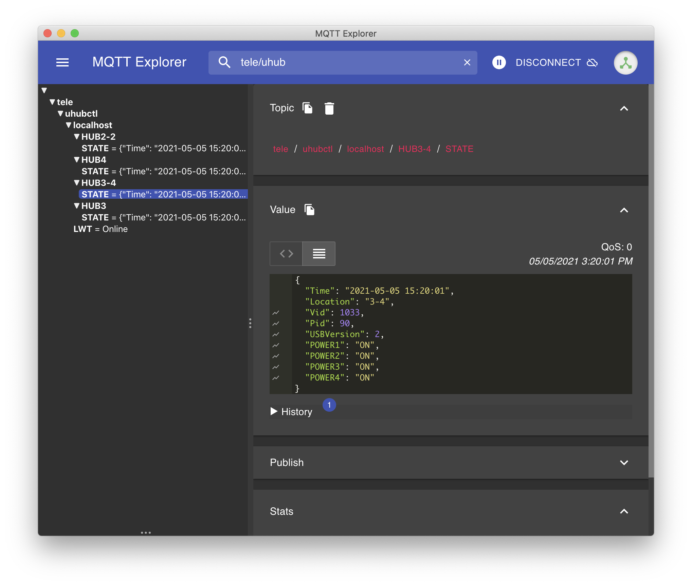

# Home Assistant Addon: MQTT Bridge for uhubctl

This project was spawned by the desire to control [`uhubctl`](https://github.com/mvp/uhubctl) from within Home Assistant.

This add-on takes advantage of the API provided by Home Assistant and is extremely easy to use. You no longer even need to set up credentials to connect to the MQTT server.

## Add-on Install Instructions
1. Navigate in your Home Assistant frontend to <kbd>Supervisor</kbd> -> <kbd>Add-on Store</kbd>.

2. Click the 3-dots menu at upper right <kbd>...</kbd> > <kbd>Repositories</kbd> and add this repository's URL: [https://github.com/mochipon/hassio-uhubctl](https://github.com/mochipon/hassio-uhubctl)

3. Scroll down the page to find the new repository, and click the new add-on named "MQTT Bridge for uhubctl"

4. Click <kbd>Install</kbd> and give it a few minutes to finish downloading.

5. Click <kbd>Start</kbd>, give it a few seconds to spin up.

## Configuration

By default, the add-on publishes telemetry data to the topic `tele/uhubctl/localhost`. Find the target hub you want to control by checking Vendor ID (`Vid`), Product ID (`Pid`), and number of ports of each hub. 



Here is an example of a yaml entry in Home Assistant to control `Port 1` of `HUB3-4`.

```yaml
switch:
  - platform: mqtt
    name: USB Fan
    unique_id: usb-fan
    icon: "mdi:fan"
    state_topic: "tele/uhubctl/localhost/HUB3-4/STATE"
    value_template: "{{ value_json.POWER1 }}"
    command_topic: "cmnd/uhubctl/localhost/HUB3-4/POWER1"
    availability_topic: "tele/uhubctl/localhost/LWT"
    payload_available: "Online"
    payload_not_available: "Offline"
```


